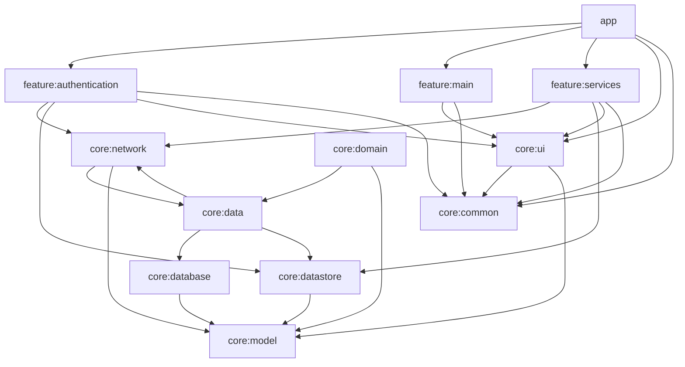

# Project Structure Documentation

## Overview

This document describes the modular architecture of the On-Demand Services App Template.

## Directory Structure

```
├── app/                         # Main application module
│   ├── src/
│   │   └── main/
│   │       ├── java/com/example/ondemand/
│   │       │   ├── MainActivity.kt
│   │       │   ├── Application.kt
│   │       │   └── RootNavigationGraph.kt
│   │       └── res/
│   ├── build.gradle.kts
│   └── ...
│
├── core/                        # Shared core modules
│   ├── common/                 # Common utilities, extensions
│   │   └── src/main/java/com/example/common/
│   │       ├── utils/
│   │       ├── extensions/
│   │       └── ...
│   │
│   ├── data/                   # Data layer implementations
│   │   └── src/main/java/com/example/data/
│   │       ├── di/             # Data module dependency injection
│   │       ├── repository/     # Repository implementations
│   │       └── ...
│   │
│   ├── database/               # Room database setup
│   │   └── src/main/java/com/example/database/
│   │       ├── dao/            # Data Access Objects
│   │       ├── entities/       # Database entities
│   │       └── ...
│   │
│   ├── datastore/              # Preferences management
│   │   └── src/main/java/com/example/datastore/
│   │       ├── di/             # DataStore module DI
│   │       ├── UserPreferences.kt
│   │       └── ...
│   │
│   ├── domain/                 # Business logic
│   │   └── src/main/java/com/example/domain/
│   │       ├── di/             # Domain module DI
│   │       ├── usecases/       # Business use cases
│   │       └── ...
│   │
│   ├── model/                  # Shared data models
│   │   └── src/main/java/com/example/model/
│   │       └── ...
│   │
│   ├── network/                # Network layer
│   │   └── src/main/java/com/example/network/
│   │       ├── api/            # API service interfaces
│   │       ├── di/             # Network module DI
│   │       ├── repository/     # Network repository implementations
│   │       ├── MockInterceptor.kt
│   │       └── ...
│   │
│   ├── ui/                     # Reusable UI components
│   │   └── src/main/java/com/example/ui/
│   │       ├── theme/          # Theme definitions
│   │       ├── utils/          # UI utilities
│   │       └── ...             # Reusable components
│   │
│   └── build.gradle.kts        # Core modules composite build
│
├── feature/                     # Feature modules
│   ├── authentication/         # Authentication flows
│   │   └── src/main/java/com/example/authentication/
│   │       ├── di/             # Auth feature DI
│   │       ├── navigation/     # Auth navigation
│   │       ├── presentation/   # Auth UI and ViewModels
│   │       │   ├── login/
│   │       │   └── signup/
│   │       └── usecases/       # Auth specific use cases
│   │
│   ├── main/                   # Main dashboard
│   │   └── src/main/java/com/example/main/
│   │       ├── di/             # Main feature DI
│   │       ├── navigation/     # Main navigation
│   │       └── presentation/   # Main UI and ViewModels
│   │
│   ├── services/               # Services catalog
│   │   └── src/main/java/com/example/services/
│   │       ├── di/             # Services feature DI
│   │       ├── navigation/     # Services navigation
│   │       ├── presentation/   # Services UI and ViewModels
│   │       └── mapper/         # Data mapping utilities
│   │
│   └── build.gradle.kts        # Feature modules composite build
│
├── gradle/                      # Gradle wrapper and configuration
├── build.gradle.kts             # Root build configuration
├── settings.gradle.kts          # Module inclusion settings
├── gradle.properties            # Gradle properties
└── README.md                   # Project documentation
```

## Module Dependencies



## Key Design Principles

1. **Modularity**: Each feature is isolated in its own module
2. **Separation of Concerns**: Clear boundaries between layers (UI, Domain, Data)
3. **Dependency Direction**: Features depend on core, core modules depend on each other when needed
4. **Reusability**: Core components can be reused across features
5. **Testability**: Each module can be tested independently
6. **Maintainability**: Changes in one module have minimal impact on others

## Naming Conventions

- **Packages**: `com.example.[module].[subpackage]`
- **Classes**: PascalCase (e.g., `UserService`, `LoginViewModel`)
- **Functions**: camelCase (e.g., `getUserProfile()`, `validateEmail()`)
- **Variables**: camelCase (e.g., `userName`, `isLoggedIn`)
- **Constants**: UPPER_SNAKE_CASE (e.g., `MAX_RETRY_COUNT`, `API_TIMEOUT`)
- **Files**: Match class name (e.g., `LoginViewModel.kt` for `LoginViewModel` class)

## Architecture Layers

### 1. Presentation Layer (feature modules)
- Compose UI components
- ViewModels for state management
- Navigation logic
- UI-specific business logic

### 2. Domain Layer (core/domain)
- Use cases implementing business logic
- Repositories interfaces
- Domain models
- Business rules and validations

### 3. Data Layer (core/data, core/database, core/network, core/datastore)
- Repository implementations
- Data sources (local, remote)
- Data mapping (DTO ↔ Domain models)
- Caching strategies

### 4. Core Layer (core/common, core/ui, core/model)
- Shared utilities and extensions
- Reusable UI components
- Base classes and interfaces
- Common data models